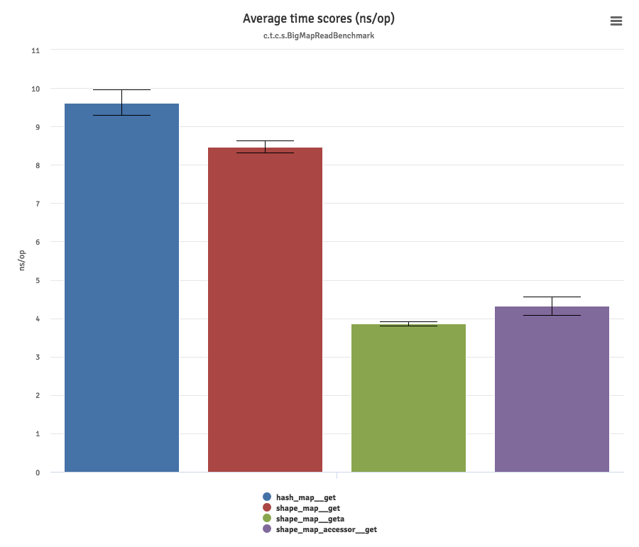

# Benchmarks

This is a set of basic [JMH](http://openjdk.java.net/projects/code-tools/jmh/) micro-benchmarks. The benchmarks build maps of various sizes and perform basic read and write operations.

The benchmarks are focused on reading/writing existing keys.

Below a sample run against JVM 8.

```bash
$ java -jar target/benchmarks.jar -wi 10 -i 10 -f 1 -bm avgt -tu ns -rf json
# JMH version: 1.19
# VM version: JDK 1.8.0_131, VM 25.131-b11
# VM invoker: /Library/Java/JavaVirtualMachines/jdk1.8.0_131.jdk/Contents/Home/jre/bin/java
# VM options: <none>
# Warmup: 10 iterations, 1 s each
# Measurement: 10 iterations, 1 s each
# Timeout: 10 min per iteration
# Threads: 1 thread, will synchronize iterations
# Benchmark mode: Average time, time/op
...

# Run complete. Total time: 00:27:58

Benchmark                                                                          Mode  Cnt   Score   Error  Units
c.t.c.constshapemap.BigMapReadBenchmark.const_shape_map__get                       avgt   10   8.207 ± 0.142  ns/op
c.t.c.constshapemap.BigMapReadBenchmark.const_shape_map__geta                      avgt   10   4.062 ± 0.247  ns/op
c.t.c.constshapemap.BigMapReadBenchmark.const_shape_map_accessor__get              avgt   10   3.884 ± 0.088  ns/op
c.t.c.constshapemap.BigMapReadBenchmark.hash_map__get                              avgt   10   9.496 ± 0.208  ns/op
c.t.c.constshapemap.BigMapWriteBenchmark.const_shape_map__put                      avgt   10   9.144 ± 0.153  ns/op
c.t.c.constshapemap.BigMapWriteBenchmark.const_shape_map__puta                     avgt   10   4.854 ± 0.119  ns/op
c.t.c.constshapemap.BigMapWriteBenchmark.const_shape_map__seta                     avgt   10   4.607 ± 0.172  ns/op
c.t.c.constshapemap.BigMapWriteBenchmark.const_shape_map_accessor__put             avgt   10   4.745 ± 0.230  ns/op
c.t.c.constshapemap.BigMapWriteBenchmark.const_shape_map_accessor__set             avgt   10   4.624 ± 0.163  ns/op
c.t.c.constshapemap.BigMapWriteBenchmark.hash_map__put                             avgt   10  18.976 ± 0.196  ns/op
c.t.c.constshapemap.MapWithCollisionsReadBenchmark.const_shape_map__get            avgt   10  11.739 ± 1.133  ns/op
c.t.c.constshapemap.MapWithCollisionsReadBenchmark.const_shape_map__geta           avgt   10   3.829 ± 0.070  ns/op
c.t.c.constshapemap.MapWithCollisionsReadBenchmark.const_shape_map_accessor__get   avgt   10   3.817 ± 0.031  ns/op
c.t.c.constshapemap.MapWithCollisionsReadBenchmark.hash_map__get                   avgt   10   9.026 ± 0.155  ns/op
c.t.c.constshapemap.MapWithCollisionsWriteBenchmark.const_shape_map__put           avgt   10  13.031 ± 0.594  ns/op
c.t.c.constshapemap.MapWithCollisionsWriteBenchmark.const_shape_map__puta          avgt   10   4.812 ± 0.073  ns/op
c.t.c.constshapemap.MapWithCollisionsWriteBenchmark.const_shape_map__seta          avgt   10   4.456 ± 0.036  ns/op
c.t.c.constshapemap.MapWithCollisionsWriteBenchmark.const_shape_map_accessor__put  avgt   10   4.692 ± 0.071  ns/op
c.t.c.constshapemap.MapWithCollisionsWriteBenchmark.const_shape_map_accessor__set  avgt   10   4.493 ± 0.083  ns/op
c.t.c.constshapemap.MapWithCollisionsWriteBenchmark.hash_map__put                  avgt   10  13.093 ± 0.254  ns/op
c.t.c.constshapemap.MediumMapReadBenchmark.const_shape_map__get                    avgt   10   9.688 ± 0.489  ns/op
c.t.c.constshapemap.MediumMapReadBenchmark.const_shape_map__geta                   avgt   10   3.873 ± 0.073  ns/op
c.t.c.constshapemap.MediumMapReadBenchmark.const_shape_map_accessor__get           avgt   10   3.832 ± 0.082  ns/op
c.t.c.constshapemap.MediumMapReadBenchmark.hash_map__get                           avgt   10   9.868 ± 0.138  ns/op
c.t.c.constshapemap.MediumMapWriteBenchmark.const_shape_map__put                   avgt   10  10.312 ± 0.511  ns/op
c.t.c.constshapemap.MediumMapWriteBenchmark.const_shape_map__puta                  avgt   10   4.844 ± 0.081  ns/op
c.t.c.constshapemap.MediumMapWriteBenchmark.const_shape_map__seta                  avgt   10   4.766 ± 0.363  ns/op
c.t.c.constshapemap.MediumMapWriteBenchmark.const_shape_map_accessor__put          avgt   10   4.698 ± 0.080  ns/op
c.t.c.constshapemap.MediumMapWriteBenchmark.const_shape_map_accessor__set          avgt   10   4.501 ± 0.074  ns/op
c.t.c.constshapemap.MediumMapWriteBenchmark.hash_map__put                          avgt   10  13.773 ± 0.271  ns/op
c.t.c.constshapemap.SmallMapReadBenchmark.const_shape_map__get                     avgt   10   7.922 ± 0.104  ns/op
c.t.c.constshapemap.SmallMapReadBenchmark.const_shape_map__geta                    avgt   10   3.876 ± 0.089  ns/op
c.t.c.constshapemap.SmallMapReadBenchmark.const_shape_map_accessor__get            avgt   10   3.996 ± 0.240  ns/op
c.t.c.constshapemap.SmallMapReadBenchmark.hash_map__get                            avgt   10   8.221 ± 0.104  ns/op
c.t.c.constshapemap.SmallMapWriteBenchmark.const_shape_map__put                    avgt   10   9.038 ± 0.178  ns/op
c.t.c.constshapemap.SmallMapWriteBenchmark.const_shape_map__puta                   avgt   10   4.812 ± 0.075  ns/op
c.t.c.constshapemap.SmallMapWriteBenchmark.const_shape_map__seta                   avgt   10   4.498 ± 0.027  ns/op
c.t.c.constshapemap.SmallMapWriteBenchmark.const_shape_map_accessor__put           avgt   10   4.745 ± 0.090  ns/op
c.t.c.constshapemap.SmallMapWriteBenchmark.const_shape_map_accessor__set           avgt   10   4.613 ± 0.189  ns/op
c.t.c.constshapemap.SmallMapWriteBenchmark.hash_map__put                           avgt   10  12.101 ± 0.103  ns/op
c.t.c.shapemap.BigMapReadBenchmark.hash_map__get                                   avgt   10   9.616 ± 0.330  ns/op
c.t.c.shapemap.BigMapReadBenchmark.shape_map__get                                  avgt   10   8.464 ± 0.158  ns/op
c.t.c.shapemap.BigMapReadBenchmark.shape_map__geta                                 avgt   10   3.855 ± 0.064  ns/op
c.t.c.shapemap.BigMapReadBenchmark.shape_map_accessor__get                         avgt   10   4.321 ± 0.244  ns/op
c.t.c.shapemap.BigMapWriteBenchmark.hash_map__put                                  avgt   10  19.119 ± 0.877  ns/op
c.t.c.shapemap.BigMapWriteBenchmark.shape_map__put                                 avgt   10   9.711 ± 0.154  ns/op
c.t.c.shapemap.BigMapWriteBenchmark.shape_map__puta                                avgt   10   6.064 ± 0.119  ns/op
c.t.c.shapemap.BigMapWriteBenchmark.shape_map__seta                                avgt   10   5.755 ± 0.098  ns/op
c.t.c.shapemap.BigMapWriteBenchmark.shape_map_accessor__put                        avgt   10   6.670 ± 0.479  ns/op
c.t.c.shapemap.BigMapWriteBenchmark.shape_map_accessor__set                        avgt   10   5.663 ± 0.105  ns/op
c.t.c.shapemap.MapWithCollisionsReadBenchmark.hash_map__get                        avgt   10   9.058 ± 0.143  ns/op
c.t.c.shapemap.MapWithCollisionsReadBenchmark.shape_map__get                       avgt   10  10.783 ± 0.184  ns/op
c.t.c.shapemap.MapWithCollisionsReadBenchmark.shape_map__geta                      avgt   10   3.829 ± 0.047  ns/op
c.t.c.shapemap.MapWithCollisionsReadBenchmark.shape_map_accessor__get              avgt   10   4.006 ± 0.198  ns/op
c.t.c.shapemap.MapWithCollisionsWriteBenchmark.hash_map__put                       avgt   10  14.524 ± 0.701  ns/op
c.t.c.shapemap.MapWithCollisionsWriteBenchmark.shape_map__put                      avgt   10  12.435 ± 0.129  ns/op
c.t.c.shapemap.MapWithCollisionsWriteBenchmark.shape_map__puta                     avgt   10   6.089 ± 0.074  ns/op
c.t.c.shapemap.MapWithCollisionsWriteBenchmark.shape_map__seta                     avgt   10   5.759 ± 0.159  ns/op
c.t.c.shapemap.MapWithCollisionsWriteBenchmark.shape_map_accessor__put             avgt   10   6.330 ± 0.034  ns/op
c.t.c.shapemap.MapWithCollisionsWriteBenchmark.shape_map_accessor__set             avgt   10   5.633 ± 0.068  ns/op
c.t.c.shapemap.MediumMapReadBenchmark.hash_map__get                                avgt   10  11.511 ± 0.596  ns/op
c.t.c.shapemap.MediumMapReadBenchmark.shape_map__get                               avgt   10   9.821 ± 0.128  ns/op
c.t.c.shapemap.MediumMapReadBenchmark.shape_map__geta                              avgt   10   3.845 ± 0.058  ns/op
c.t.c.shapemap.MediumMapReadBenchmark.shape_map_accessor__get                      avgt   10   3.822 ± 0.050  ns/op
c.t.c.shapemap.MediumMapWriteBenchmark.hash_map__put                               avgt   10  13.731 ± 0.148  ns/op
c.t.c.shapemap.MediumMapWriteBenchmark.shape_map__put                              avgt   10  10.977 ± 0.184  ns/op
c.t.c.shapemap.MediumMapWriteBenchmark.shape_map__puta                             avgt   10   6.645 ± 0.417  ns/op
c.t.c.shapemap.MediumMapWriteBenchmark.shape_map__seta                             avgt   10   5.737 ± 0.199  ns/op
c.t.c.shapemap.MediumMapWriteBenchmark.shape_map_accessor__put                     avgt   10   6.311 ± 0.037  ns/op
c.t.c.shapemap.MediumMapWriteBenchmark.shape_map_accessor__set                     avgt   10   5.597 ± 0.053  ns/op
c.t.c.shapemap.SmallMapReadBenchmark.hash_map__get                                 avgt   10   8.196 ± 0.109  ns/op
c.t.c.shapemap.SmallMapReadBenchmark.shape_map__get                                avgt   10   8.681 ± 0.498  ns/op
c.t.c.shapemap.SmallMapReadBenchmark.shape_map__geta                               avgt   10   4.140 ± 0.352  ns/op
c.t.c.shapemap.SmallMapReadBenchmark.shape_map_accessor__get                       avgt   10   3.930 ± 0.200  ns/op
c.t.c.shapemap.SmallMapWriteBenchmark.hash_map__put                                avgt   10  12.049 ± 0.170  ns/op
c.t.c.shapemap.SmallMapWriteBenchmark.shape_map__put                               avgt   10   9.567 ± 0.130  ns/op
c.t.c.shapemap.SmallMapWriteBenchmark.shape_map__puta                              avgt   10   6.063 ± 0.107  ns/op
c.t.c.shapemap.SmallMapWriteBenchmark.shape_map__seta                              avgt   10   5.721 ± 0.075  ns/op
c.t.c.shapemap.SmallMapWriteBenchmark.shape_map_accessor__put                      avgt   10   6.597 ± 0.417  ns/op
c.t.c.shapemap.SmallMapWriteBenchmark.shape_map_accessor__set                      avgt   10   5.660 ± 0.196  ns/op

Benchmark result is saved to jmh-result.json

```

Micro-benchmarking is hard, but the results do seem consistent with performance expectations regarding the inline caching accessor.


## Running the benchmarks

You must build the benchmark code then run it using the JMH command line.

```bash
$ mvn clean install
...
$ java -jar target/benchmarks.jar -h # shows help options

# running with 10 warm up cycles, 10 iterations, 1 fork, measure average time in ns, and write a json output file
java -jar target/benchmarks.jar -wi 10 -i 10 -f 1 -bm avgt -tu ns -rf json
```

## Visualizing benchmark results
The [jmh-result.json](jmh-result.json) file the benchmark creates is visualized well by [JMH-charts](http://nilskp.github.io/jmh-charts/). JMH-charts generates comparison charts for each benchmark similar to the following image. It is comparing execution times for reading existing keys using different approaches, lower is better:


